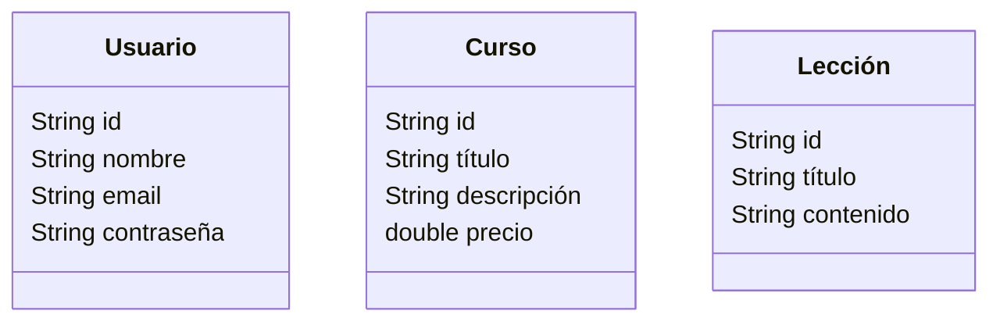

# Modelo del dominio inicial

Queremos desarrollar un sitio web dedicado a la formación de nuestros usuario gracias a los *cursos en linea* que ofrece esta web. En el sitio los usuarios autentificados podrán apuntarse a cursos, y un usuario podrá acceder a las lecciones de los cursos a los que pertenezca. Los usuarios deberían poder buscar y ver cursos, y si se autentifican poder apuntarse a estos.

<aside>
💡 En los sitios reales de este tipo, un curso suele tener reseñas  para ver si los usuarios han quedado satisfechos tras la realización del cuso, para que futuros usuarios sean atraídos si tiene buenas reseñas este.
</aside>

### Definición inicial de los modelos

De momento sin relaciones, solo los atributos que se nos ocurren inicialmente, luego podrían cambiar

