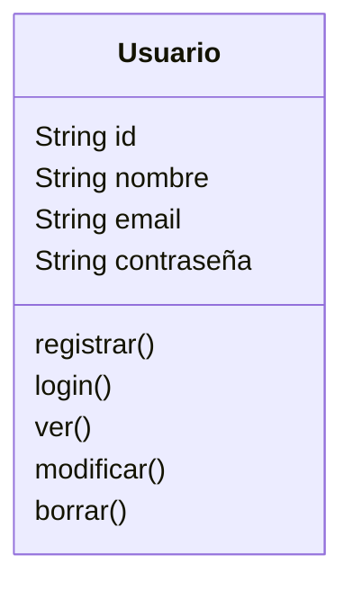
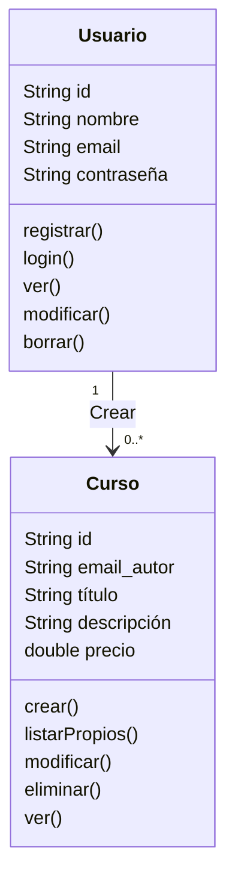
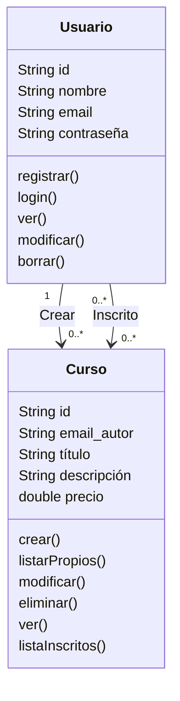
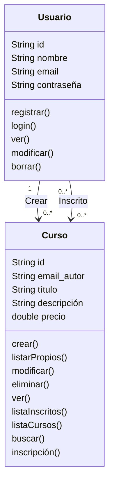
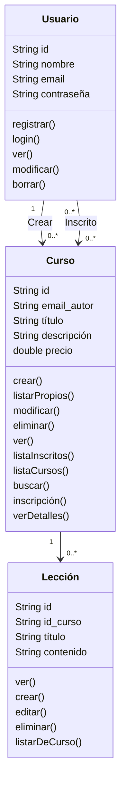

# Mapeado de las historias de usuario en el modelo

**Usuarios**

Historias 1.1, 1.2, 1.3: registro, edición, baja, modificación, inicio de sesión

**Cursos**

Historias 2.1, 2.2: crear cursos, ver, modificar, eliminar cursos creados por el usuario

- Para poder ver, modificar o eliminar los proyectos del usuario necesitamos saber qué usuario ha creado el curso (relación “crea”).

- Para poder listar los inscritos a un curso (2.2) necesitamos una relación “_inscrito_”, que sería de muchos a muchos.

<aside>
💡 Si usamos una BD relacional para almacenar los datos, a nivel de la BD para modelar la relación “Inscrito”, que es de muchos a muchos, necesitaremos una tabla adicional, p.ej. “Inscritos”, en la que cada fila tendría el id del usuario y el id del curso al que esta apuntado. Pero recordemos que el modelo de datos del API REST no es lo mismo que el de una BD relacional, a este nivel como veremos podemos o no crear el recurso “Inscripción”

</aside>

Historias 2.3, 2.4, y 2.6

Historia 2.5: ver detalles de un curso, incluyendo las lecciones, para eso necesitamos (ya lo mostramos en el diagrama final para no ser pesados):

- una acción `verDetalles`en el curso.
- una relación de uno a muchos de cursos a lecciones
- una acción en Curso para ver las lecciones de un proyecto

**Lecciones**

Historias 2.7, 2.8: acciones para ver, crear, modificar y eliminar lecciones

Finalmente el diagrama completo queda como sigue

